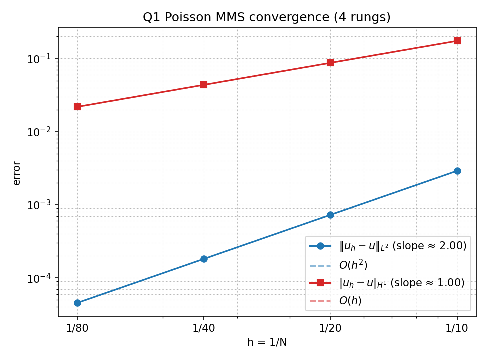
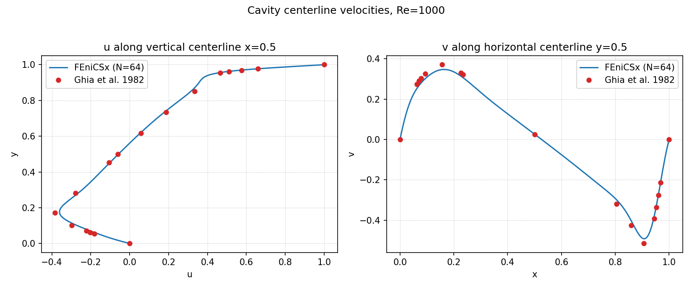
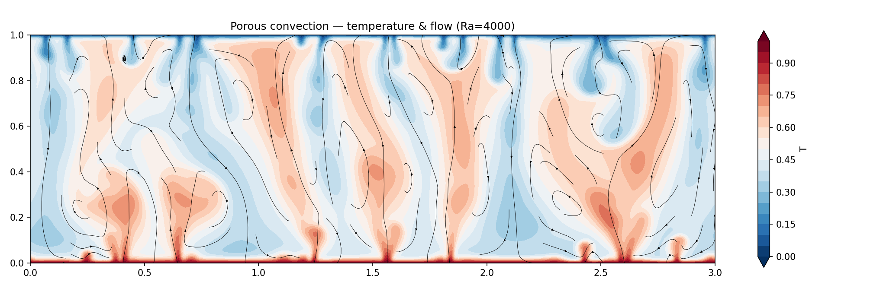

# FEniCSx FE Tutorial — Poisson, Lid-Driven Cavity & Porous Convection

A prompt-driven agentic demo: hand one of the prompts in [`prompts/`](./prompts/)
to a coding agent (Claude Code or the Gemini CLI) and it produces a finite-element
example in **FEniCSx / DOLFINx**. Two modes:

- **Example 1 is build-from-scratch** — the agent writes the solver from a spec.
- **Examples 2 & 3 ship a working solver** the agent **drives and extends**
  through two activities: *run-and-watch*, then *quantify-and-validate*.

The PDEs are deliberately classic; the point is to watch an agent **build**,
**verify**, and **visualize** real FE code end to end. Each prompt is
self-contained — pick one and go. Reference results live in [`gold/`](./gold/);
the maths is written up in [`docs/`](./docs/).

## The three examples

### 1. Poisson MMS verification — [prompt](./prompts/poisson_mms.md) · [docs](./docs/poisson_mms.md)

*Build from scratch.* A 3D Poisson solve (Q1 hexahedra) verified by a
method-of-manufactured-solutions convergence sweep (L² at `O(h²)`, H¹ at `O(h)`)
that reproduces checked-in gold, plus a solution contour.



### 2. Lid-driven cavity — [prompt](./prompts/lid_driven_cavity.md) · [docs](./docs/lid_driven_cavity.md)

*Drive & extend* a shipped transient IPCS Navier–Stokes solver (Taylor–Hood
P2/P1): run the **Re = 1000** spin-up to steady state, then add centerline
diagnostics and validate over `Re ∈ {100, 400, 1000}` against the **Ghia et al.
(1982)** benchmark (`gold/ghia_re*.csv`).



### 3. Porous convection (Rayleigh–Darcy) — [prompt](./prompts/porous_convection.md) · [docs](./docs/porous_convection.md)

*Drive & extend* a shipped streamfunction–temperature solver on a laterally
periodic porous layer (uses the **`dolfinx_mpc`** periodic-BC extension): run the
**Ra = 4000** showcase to watch hot/cold **plumes** form, then add the Nusselt
diagnostic and validate the **`Nu ≈ 0.0069·Ra`** scaling (Hewitt, Neufeld &
Lister 2012) over `Ra ∈ {500, 1000, 2000}`.



## Disclaimer — run at your own risk

Both this README and the files in [`prompts/`](./prompts/) were drafted by an AI
assistant; deciding whether their claims hold for your setup is on **you**. The
author accepts no liability for damage to your machine, accounts, or data.

[`.claude/settings.json`](./.claude/settings.json) hands the agent a wide-open
allowlist — `Bash`, `Read`, `Edit`, `Write`, `Task`, and web search run without
prompting. Any content the agent pulls in (web results, fetched pages, files in
`/demo`) can attempt **prompt injection**, and a successful one can run arbitrary
shell in the container, modify host files through the workspace bind mount, and
exfiltrate the CLI OAuth token. The container is hardened (non-root,
`no-new-privileges`, all capabilities dropped) but is **not a sandbox** —
bind-mounted files are real host files. Tighten `.claude/settings.json` before
running this against anything you care about.

## Setup

**Prerequisites:** [VSCode](https://code.visualstudio.com/) with the
[Dev Containers](https://marketplace.visualstudio.com/items?itemName=ms-vscode-remote.remote-containers)
extension, and a container engine
([Docker Desktop](https://www.docker.com/products/docker-desktop/) or
[Podman](https://podman.io/)). The base
[DOLFINx image](https://hub.docker.com/r/dolfinx/dolfinx) is ~1 GB, so give the
engine a few GB of disk and memory.

1. **Open in the container.** From the repo root, run **Dev Containers: Reopen in
   Container** (`⌘⇧P` / `Ctrl⇧P`). VSCode builds [`Dockerfile`](./Dockerfile)
   (`FROM` the official DOLFINx image, so FEniCSx, PETSc and MPI are already
   inside — there is no toolchain to pre-build; it also compiles `dolfinx_mpc`
   for Example 3, adding a few minutes to the first build). Terminals land in
   `/demo` as the `demo` user.

2. **Launch the agent.** In a container terminal:
   ```bash
   cd /demo && claude
   ```
   First run opens an OAuth URL; the token lives only inside the container. Enter
   `/plan`, then point the agent at **one** prompt, e.g.
   `Follow the instructions in @prompts/poisson_mms.md.` (Prefer Gemini? `gemini`
   is installed in the image too.)

3. **Run & verify.** DOLFINx is MPI-parallel; the example solvers run on 4 ranks.
   ```bash
   # Example 1 — Poisson MMS sweep + contour (agent writes examples/poisson_mms.py)
   export MMS_CONVERGENCE_CSV=results/poisson_mms_q1_convergence.csv
   mpirun -np 4 python examples/poisson_mms.py
   diff -u gold/poisson_mms_q1_convergence.csv "$MMS_CONVERGENCE_CSV"

   # Example 2 — lid-driven cavity: spin-up + Ghia comparison
   ./run_cavity.sh
   python scripts/lid_driven_cavity/plot_cavity.py results/cavity results/cavity

   # Example 3 — porous convection: plume montage/GIF + Nu–Ra check
   ./run_porous.sh
   python scripts/porous_convection/plot_porous.py results/porous results/porous
   ```
